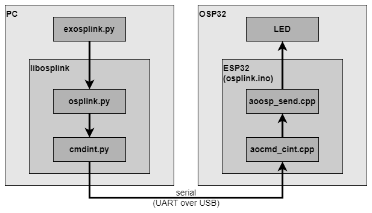

# OSPlink and Python

Python can be used to control an OSP chain, by sending commands
to the command interpreted that is part of the firmware in the ESP32.
This is still a proof-of-concept in an experimental phase.

## Ingredients

The experiment in this directory consists of the following ingredients.

- OSP32 board with the ESP32 flashed with the
  [osplink.ino](https://github.com/ams-OSRAM/OSP_aotop/tree/main/examples/osplink)
  firmware.

- An experimental Python library [**lib**osplink](libosplink). It contains
  two modules: `cmdint.py` interacts with the command interpreter in the ESP 
  (sending and receiving strings over serial), and module `osplink.py` makes 
  the ESP commands available on high level in Python.
  
  For example the python function `osp_goactive(<addr>)` in the Python lib 
  `libosplink.osplink` uses the Python lib `libosplink.cmdint` to send the 
  string `"osp send <addr> goactive"` over serial. The command interpreter in 
  the ESP would receive that string and call the C function 
  `aoosp_tele_goactive(<addr>)`.

- A simple Python example [**ex**cmdint](excmdint).
  A Python program that sends plain command strings
  like `"echo Hello, world!"`; thus only using `libosplink.cmdint`.

- A simple Python example [**ex**osplink](exosplink).
  A Python program that calls high level functions like 
  `osplink.osp_setpwmchn(0x001,0,0x3333,0x0000,0x0000)`;
  thus using `libosplink.osplink` on top of `libosplink.cmdint`.

## Running an experiment

Try one of the two examples 

- command interpreter example [excmdint](excmdint);

- osplink example [exosplink](exosplink).

(end)
