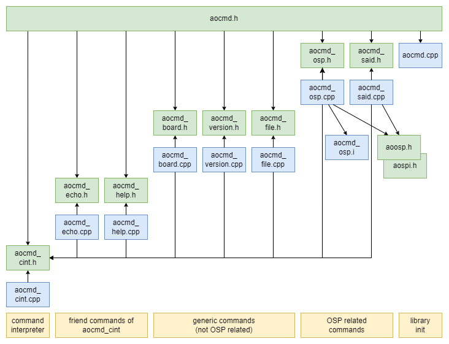

# OSP CommandInterpreter aocmd

Library "OSP CommandInterpreter aocmd", usually abbreviated to "aocmd", 
is one of the **aolibs**; short for Arduino OSP libraries from ams-OSRAM.
This suite implements support for chips that use the Open System Protocol, 
like the AS1163 ("SAID") or the OSIRE E3731i ("RGBi").
The landing page for the _aolibs_ is on 
[GitHub](https://github.com/ams-OSRAM-Group/OSP_aotop).


## Introduction

Library _aocmd_ contains a command interpreter and several commands.
The interesting command is "osp"; it allows sending and receiving OSP telegrams.


The command interpreter can be extended with application specific commands.
Furthermore, a command file can be stored persistently on the ESP32, 
and executed at startup. 


### System setup

The diagram below shows the system architecture from a command interpreter point of view.


On the right hand side, we see the OSP32 board with some SAIDs.
They are controlled by the firmware in the ESP, more specifically, 
via the OSP library (aoosp) which builds on top of the SPI library (aospi).

On the left hand side, we see a PC. It runs an application known as 
_terminal_. A famous one is [putty](https://www.putty.org/), but the
Serial Monitor in the Arduino IDE is also fine. Terminals allow a user
to enter commands (characters) and send them over a serial link to a 
"remote" (in our case OSP32). When the remote responds (with characters), 
data is sent back over the serial line and displayed by the terminal.

Since PC's no longer have serial ports, a serial-to-USB chip is used.
The ESP32S3 DevKit board employs an "CP210x USB to UART Bridge"
and the PC needs to have a driver for such a virtual COM port. 
Typically, the Arduino IDE installs those drivers. If not, download and 
install the [driver](https://www.silabs.com/developers/usb-to-uart-bridge-vcp-drivers).

Commands that the PC sends, arrive at the command interpreter, a part of the
ESP firmware. Commands like "echo", "help", "file", "osp" are received
and dispatched to command _handlers_. Those parse and then execute them,
for example by calling the _aoosp_ library.

There is one more feature: the ESP has a persistent memory (EEPROM).
The command interpreter has a command to show, enter an execute one 
command file (known as `boot.cmd`). This command file is automatically
executed on power-on-reset. The maximum size of `boot.cmd` is 2k byte.


### Example commands

This section gives a flavor of the stock commands. It is possible to add your 
own, and for example the _aomw_ and _aoapps_ libraries add (more high-level) 
commands.

The easiest command is `echo`.

```text
>> echo Hello, world!
Hello, world!
```

A better place to start however, is the `help` command. 

```text
>> help
board - board info and commands
echo - echo a message (or en/disables echoing)
file - manages the file 'boot.cmd' with commands run at startup
help - gives help (try 'help help')
osp - sends and receives OSP telegrams
said - sends and receives SAID specific telegrams
topo - build, query and use topology
version - version of this application, its libraries and tools to build it
```

The `help` command in isolation lists all commands, 
but it can also give help on a specific command; just append its name.
Here we show help on version, since that help text is nicely short.

```text
>> help version
SYNTAX: version
- lists version of this application, its libraries and tools to build it
NOTES:
- supports @-prefix to suppress output
```

The help for the `osp` command is long; the help command allows  
selecting a topic (sub command of `osp` in this case).

```text
>> help osp dirmux
SYNTAX: osp dirmux [ bidir | loop ]
- without optional argument shows the status of the direction mux
- with optional argument sets the direction mux to bi-directional or loop
```

Let's try to run the `version` command.

```text
>> version
app     : Application version example 1.5
runtime : Arduino ESP32 2_0_14
compiler: 8.4.0
arduino : 10607 (likely IDE2.x)
compiled: May  8 2024, 17:56:47
aolibs  : result 0.1.2 spi 0.2.0 osp 0.1.5 cmd 0.1.1
```

One feature of the command interpreter is that all commands and sub commands 
may be shortened (even to one character), so the following shorthand `h v` 
gives the same result as the previous `help version`.

```text
>> h v
SYNTAX: version
- lists version of this application, its libraries and tools to build it
NOTES:
- supports @-prefix to suppress output
```

Comment starts with `//`.
Some commands support a `@` as prefix; it suppresses output of that command.
For example, setting the direction mux, shows the final state, but that can be suppressed with the `@`.

```text
>> // comment without command
>> osp dirmux loop // shows new status
mux (dir): loop
>> @osp dirmux loop // with @ no feedback on new status
>>
```

The `board` command gives some info on the ESP hardware.

```text
>> board
chip : model ESP32-S3 (2 cores) rev 0
clk  : 240 MHz (xtal 40 MHz)
ftrs : 2.4GHz-WiFi Bluetooth-LE
flash: 4194304 byte external flash
app  : 378544 byte
reset: power-on
```

An interesting sub command, especially during development, is `board reboot`;
it resets the ESP, and does not execute `boot.cmd`. In other words this 
command invokes a clean restart of the ESP. Note however, that the OSP nodes 
and the OLED remain powered, so they keep their state, unless the ESP 
firmware resets them. 

If `boot.cmd` is needed after `board reboot`, give command `file exec`.

The key command of this library is the _osp_ command.
It is able to enumerate which nodes are in the OSP chain.

```text
>> osp enum
 mcu N001 00000040/SAID T0 T1 T2 lvds
lvds N002 00000040/SAID T3 T4 T5 lvds
lvds N003 00000040/SAID T6 T7 T8 lvds
lvds N004 00000000/RGBI T9 lvds
lvds N005 00000040/SAID T10 T11 I0 lvds
lvds N006 00000000/RGBI T12 lvds
lvds N007 00000000/RGBI T13 lvds
lvds N008 00000000/RGBI T14 lvds
lvds N009 00000040/SAID T15 T16 T17 eol
nodes(N) 9 triplets(T) 18 i2cbridges(I) 1 dir loop
```

The `osp` command has information on all (currently known) telegrams.
This is retrieved with the `info` sub command.

```text
>> osp info setpwmchn
TELEGRAM 4F: setpwmchn
DESCRIPTION: Sets PWM for RGB (3x2 bytes), 7th byte is unused, 8th denotes 
             the channel .
CASTING    : uni multi broad 
PAYLOAD    : 8 (chn unused red1 red0 grn1 grn0 blu1 blu0); no response
STATUS REQ : no (tele 6F/setpwm_sr has sr)
DUPLICATE  : 4F/setpwm 
```

There is a "high level" way to send OSP telegrams.
The firmware will fill in the preamble, payload size indicator, telegram id and crc.
The following high level command sequence switches on two RGBs.

Note, if an app is running it is wise to terminate it by switching to 
do-nothing app with the command `app switch void`.

```text
osp send 000 reset
osp send 001 initbidir
osp send 000 clrerror
osp send 000 goactive
osp send 001 setpwmchn 00 FF 00 00 11 11 00 00
osp send 002 setpwmchn 00 FF 00 00 00 00 11 11
```

There is also a "low level" way to send OSP telegrams.
Here, the user has to enter all details 
(there is a feature to get the CRC computed).
This is especially useful for testing.

```text
osp tx A0 00 00 22 // 000 reset
osp tx A0 04 02 A9 // 001 initbidir
osp tx A0 00 01 0D // 000 clrerror
osp tx A0 00 05 B1 // 000 goactive
osp tx A0 07 CF 00 FF 00 00 11 11 00 00 49 // 001 setpwmchn 00 grn
osp tx A0 0B CF 00 FF 00 00 00 00 11 11 5D // 002 setpwmchn 00 blu
```

The fragment below shows the `osp` command in action, sending `02/initbidir` and receiving the answer.

```text
>> osp trx A0 04 02 A9
tx A0 04 02 A9
rx A0 05 02 72 50 DA (53 us) ok
```

If commands are sent, they are validated (see `osp validate`).
Even if validation fails, for example because the CRC doesn't match, or the payload doesn't match,
the telegram is still sent. This allows for testing error behavior also.

Note that a typical initialization sequence is as follows
(and make sure to have something wired to the OSP32 board).


```
osp send 000 reset
osp dirmux loop
osp send 001 initloop
```

or 

```
osp send 000 reset
osp dirmux bidir
osp send 001 initbidir
```

This can be abbreviated to

```
osp resetinit
```

which first tries Loop, and then BiDir (and also controls the dirmux).

In addition to the generic `osp` command, there is the `said` command,
with support specifically for the SAID chip.
As an example of the `said` command, the fragment below scans the entire OSP chain
for SAIDs, checks if the have an I2C bus, and if so, scans the I2C bus.

```C++
>> said i2c 000 scan
SAID 001 has I2C (now powered)
  00:  00  01  02  03  04  05  06  07  08  09  0a  0b  0c  0d  0e  0f 
  10:  10  11  12  13  14  15  16  17  18  19  1a  1b  1c  1d  1e  1f 
  20:  20  21  22  23  24  25  26  27  28  29  2a  2b  2c  2d  2e  2f 
  30:  30  31  32  33  34  35  36  37  38  39  3a  3b  3c  3d  3e  3f 
  40:  40  41  42  43  44  45  46  47  48  49  4a  4b  4c  4d  4e  4f 
  50: [50] 51  52  53  54  55  56  57  58  59  5a  5b  5c  5d  5e  5f 
  60:  60  61  62  63  64  65  66  67  68  69  6a  6b  6c  6d  6e  6f 
  70:  70  71  72  73  74  75  76  77  78  79  7a  7b  7c  7d  7e  7f 
SAID 001 has 1 I2C devices

SAID 005 has I2C (now powered)
  00:  00  01  02  03  04  05  06  07  08  09  0a  0b  0c  0d  0e  0f 
  10:  10  11  12  13  14  15  16  17  18  19  1a  1b  1c  1d  1e  1f 
  20: [20] 21  22  23  24  25  26  27  28  29  2a  2b  2c  2d  2e  2f 
  30:  30  31  32  33  34  35  36  37  38  39  3a  3b  3c  3d  3e  3f 
  40:  40  41  42  43  44  45  46  47  48  49  4a  4b  4c  4d  4e  4f 
  50: [50][51] 52  53  54  55  56  57  58  59  5a  5b  5c  5d  5e  5f 
  60:  60  61  62  63  64  65  66  67  68  69  6a  6b  6c  6d  6e  6f 
  70:  70  71  72  73  74  75  76  77  78  79  7a  7b  7c  7d  7e  7f 
SAID 005 has 3 I2C devices

2 SAIDs have 4 I2C devices
>> 
```


## Examples

This library comes with the following examples.
You can find them in the Arduino IDE via 
File > Examples > OSP CommandInterpreter aocmd > ...

- **aocmd_min** ([source](examples/aocmd_min))  
  This demo initializes the command interpreter, then starts
  polling `Serial` for incoming characters. These are buffered until an 
  end-of-line is received (either CR or LF), then the command is parsed 
  and executed. This demo does not add its own command.

- **aocmd_owncmd** ([source](examples/aocmd_owncmd))  
  This demo implements an application specific command, and
  registers it with the command interpreter.
  The new command has name `stat`. It allows passing several (hex) numbers.
  The `stat` command keeps track of the count and the sum.

- **aocmd_boot** ([source](examples/aocmd_boot))  
  This demo implements an application that prints a message every x ms.
  It adds a command ("wait") to set and get x.
  This command can then be stored in `boot.cmd`, to configure this app persistently.

- **aocmd_template** ([source](examples/aocmd_template))  
  This sketch is a template for an application with a command handler.
  It includes an application banner, it implements the upcalls from 
  the "version" command, and it runs `boot.cmd` on startup.
 
There is also an official executable - as opposed to an example.

- **osplink** ([source](../OSP_aotop/examples/osplink))  
  This application allows the PC (with a terminal like the Arduino Serial Monitor)
  to send and receive OSP telegrams, using serial-over-USB. 
  
  It even comes with an _experimental_ Python library [libosplink](python/libosplink) 
  and a Python application [exosplink](python/exosplink)
  


## Module architecture

This library contains several modules, see the figure below for an overview (arrows indicate `#include`).



- **aocmd_cint** (`aocmd_cint.cpp` and `aocmd_cint.h`) is the core module 
  of the library; it implements the command interpreter. 
  All other modules implement command handlers.
  The command handlers are registered with the command interpreter.
  When the user enters a command whose name matches one of the registered ones,
  the command interpreter calls the handler.
  
  The command interpreter is a recycled library 
  [https://github.com/maarten-pennings/cmd](https://github.com/maarten-pennings/cmd).
  Version 8.1.0 is used. 
  The prefix is changed from `cmd` to `aocmd_cint`, and two friend commands (`echo` and `help`) 
  were split off (put in separate files).
  No API documentation has been added.

- **aocmd_echo** (`aocmd_echo.cpp` and `aocmd_echo.h`) is the first friend command of
  the command interpreter. Friend, because it _configures_ the command interpreter,
  e.g. enable/disable command echoing.

- **aocmd_help** (`aocmd_help.cpp` and `aocmd_help.h`) is the second friend command of
  the command interpreter. Friend, because it knows which commands are registered 
  with the command interpreter, so it can provide help on them.

  Use `help xxx` to get (syntax) help on command `xxx`.

- **aocmd_board** (`aocmd_board.cpp` and `aocmd_board.h`) is a generic command giving some
  information about the board: which micro controller (revision, features), memory sizes.
  It also allows the user to issue a software reset (`board reboot`); this resets the ESP 
  and restarts the software.

  Note that `aocmd_board` has intimate knowledge of the ESP32S3, so it is 
  unlikely to run unmodified on other CPUs.
  
- **aocmd_version** (`aocmd_version.cpp` and `aocmd_version.h`) is a generic command listing
  various versions: of the application, libraries, compiler, and IDE. It has two callbacks,
  one for the application to print is version number, and one generic, for any other
  version info an application might want to print.

- **aocmd_file** (`aocmd_file.cpp` and `aocmd_file.h`) is a generic command that manages
  one file (`boot.cmd`) stored in a simple persistent file system (EEPROM of ESP, max 2k byte).
  The crux of `boot.cmd` is that it runs on power-on, so it can be used to configure and
  application.

- **aocmd_osp** (`aocmd_osp.cpp` with `aocmd_osp.i`, and `aocmd_osp.h`) is the core command to support the OSP
  protocol. The `info` sub command is a "help" command giving all (details of all) 
  telegrams, `enum` enumerates the nodes in the OSP chain connected to the MCU, and `resetinit`
  resets and initializes the OSP chain.
  
  The key sub commands are `send` and `tx`. They allows sending (and receiving the response)
  telegrams. The `send` command is high level; the preamble, payload size, telegram id, crc
  are supplied automatically. The `tx` is low level, all bytes have to be hand composed.
  Both commands allow sending miss-formed telegrams (`tx` even more so than `send`). This
  allows checking error handling behavior, and border cases.
  
  The file `aocmd_osp.i` contains a table of all know telegrams. It is used to select
  telegrams by name, and also to validate the other fields of the telegrams, like
  payload size.
  
- **aocmd_said** (`aocmd_said.cpp` and `aocmd_said.h`) command is for specific SAID features
  like OTP and I2C.


## API

The header [aocmd.h](src/aocmd.h) contains the API of this library.
It includes the module headers 
[aocmd_cint.h](src/aocmd_cint.h), 
[aocmd_echo.h](src/aocmd_echo.h), 
[aocmd_help.h](src/aocmd_help.h), 
[aocmd_board.h](src/aocmd_board.h), 
[aocmd_version.h](src/aocmd_version.h), 
[aocmd_file.h](src/aocmd_file.h), 
[aocmd_osp.h](src/aocmd_osp.h), and
[aocmd_said.h](src/aocmd_said.h).

The headers (h files) contain little documentation; for details see the module sources (cpp files). 


### aocmd

- `aocmd_init()` initializes the library (command interpreter and file system).
- `AOCMD_VERSION`  identifies the version of the library.
- `aocmd_register()` registers all commands from this library - a shorthand for calling the 
  register of all commands contained in the library individually.


### aocmd_cint

This module is recycled from the public domain. The header file contains one-line explanations of each
function. Here we will just give a high level overview.

- There are several macros `AOCMD_CINT_XXX` which configure the "size" of the command interpreter, 
  like the maximum number of registered commands or the maximum length of a command line.

- For applications _using_ a command line the key functions (after `aocmd_init()`) 
  are `aocmd_cint_prompt` and `aocmd_cint_pollserial`.
  
  ```c++
  void setup() {
    Serial.begin(115200);
    ...
    aocmd_init(); 
    aocmd_register();
    ...
    // optional: aocmd_file_bootcmd_exec_on_por(); 
    ...
    aocmd_cint_prompt();
  }

  void loop() {
    aocmd_cint_pollserial();
    ...
  }
  ```

- When _implementing_ a command, the signature of the command handler 
  (`aocmd_cint_func_t`) is important, as well as how to register it 
  (`aocmd_cint_register()`). In the command handler, parser routines such as 
  `aocmd_cint_parse_hex()` and `aocmd_cint_isprefix()` are helpful.


### aocmd_echo, aocmd_help, aocmd_board, aocmd_version, aocmd_file, aocmd_osp, aocmd_said

All these modules have a function, to register the command. We explain "echo" only.

- `aocmd_echo_register()` registers the built-in "echo" command with the command interpreter.

Recall that `aocmd_register()` calls all register functions in this library.
So, either call that one, or call a subset of `aocmd_xxx_register()`.

Some of the modules require initialization like `aocmd_file_init()` and `aocmd_osp_init()`.
This initializes the file system, respectively telegram parser, but these are called from `aocmd_init()`,
so normal client code does not need to call any of the initialization functions.


### aocmd_version

In addition to `aocmd_version_register()`, there are two weak upcalls 
from the `version` command handler.

- **weak** `aocmd_version_app()`; it shall print to Serial the application name and version.
- **weak** `aocmd_version_extra()`; it may print to Serial additional ingredients with name and version.

"Weak" means that an application can re-implement those functions 
(using the exact same name), and those re-implementations take precedence 
over these weak implementations.

The default implementation is printing a stub line respectively printing 
nothing.


### aocmd_file

In addition to `aocmd_file_register()` and `aocmd_file_init()`, there is 
one other public function:

- `aocmd_file_bootcmd_exec_on_por()` executes the file `boot.cmd` on 
  power on reset, by feeding its content to the command interpreter.

- Note that the size of `boot.cmd` is limited to 2047 including the 
  terminating 0.


## Execution architecture

### Main loop

When the command interpreter is integrated into an Arduino application, 
it has the following form:

```c++
void setup() {
  Serial.begin(115200);
  aocmd_init(); 
}

void loop() {
  aocmd_cint_pollserial();
  ...other...
}
```

- The command interpreter uses `Serial` to receive commands and transmit answers.
  This usage is implicit (accessing the global symbol `Serial`), so `Serial` 
  must have been `begin()`.

- The command interpreter must have been initialized, this is part 
  of `aocmd_init()`.

- Finally, the function `aocmd_cint_pollserial()` is a convenience function.
  It check `Serial` for incoming characters, and passes them to the command 
  interpreter.
  The command interpreter stores them until a CR or LF is received.
  Then the command interpreter parses the command line (splits it in 
  arguments `argc` and `argv[]`), looks up the command name and executes 
  the associated handler.

- The function `aocmd_cint_pollserial()` checks for incoming characters using 
  the `HardwareSerial` interrupt service routine. That routine picks up 
  incoming characters, and stores them in in a buffer with size 
  `HardwareSerial_rxBufferSize(256)`. 
  
  In other words, when characters come in at a high pace there is a risk of 
  losing them (buffer overflow). To mitigate this risk, and for the liveliness 
  of the command interpreter, it is best if the execution time of `...other...`
  is small (well below 100ms).


### Upcalls via weak linking

The `aocmd` uses weak linking as a mechanism to let the library upcall to 
the application.

It is used by the `version` command. It has two functions with weak linkage 
`aocmd_version_app()` and `aocmd_version_extra()`.
The first one is a stub printing `no application version version registered`; it shall be replaced by a function in the application that
prints to Serial the application name and version.

The second function is empty; it may be replaced by am application specific function 
that prints to Serial additional ingredients with name and version.


## Python (experimental)

The [execs](../../execs) directory contains an Arduino sketch `osplink`.
This is an application, that contains just the command interpreter, 
and with that the commands to send and receive telegrams.

The directory [python](python) in `aocmd` contains a one Python library 
(`libosplink`). This library has one object that can communicate to any 
command interpreter (`cmdint`), and one object that can communicate to 
the command interpreter as implemented in the Arduino `osplink` sketch.

The directory [python](python) in `aocmd` also contains two Python examples 
(`excmdint` and `exosplink`) that demonstrate how to use those objects. 
Both Python examples make use of a Python virtual environment. Start a 
windows `cmd.exe` shall, run the batch file `setup.bat`, and then run the 
batch file `run.bat`. See the respective `readme.md` for some details.


## Version history _aocmd_

- **2024 aug 28, 0.5.1**
  - Command `help <cmd>` now has topic selector.
  - Commands `help` and `said` now support prefix-@ to suppress output.
  - Command `osp` now prints round trip time.
  - More uniform error messages in command handlers "'xxx' expected 'yyy', not 'zzz'", "'xxx' has unknown argument ('zzz')", and "'xxx' has too many args"
  - Removed `[@]` in SYNTAX help.
  - Added links in `readme.md` for all example sketches.
  - Commands `osp send`, `osp tx`, and `osp trx` validate initloop/bidir telegrams against dirmux state.
  - Updates to `readme.md` and `system.drawio.png`.
  
- **2024 aug 9, 0.5.0**  
  - Added comment on `F()` and `PSTR()`; `aocm_board` being ESP32S3 specific and `boot.cmd` being 2k max.
  - Removed `docname` (aka old name or datasheet name) in `aocmd_osp.cpp`/`aocmd_osp.i`.
  - Corrected link to GitHub from aotop to OSP_aotop.
  - Remove "oalib" from `sentence=` in `library.properties`.
  - Typos in `aocmd_cint.h` fixed
  - Arduino name changed from `OSP Command interpreter - aocmd` to `OSP CommandInterpreter aocmd`.
  - Renamed dir `extra` to `extras`.
  - Added command `osp hwtest` to help testing the OSP32 board.
  - Command `osp enum` now has summary formatted the same as `topo enum`.
  - `license.txt` line endings changed from LF to CR+LF.

- **2024 Jul 02, 0.4.4**  
  - Initial release candidate.


(end)
