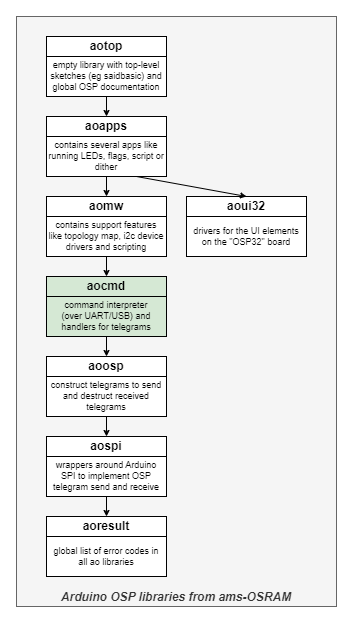
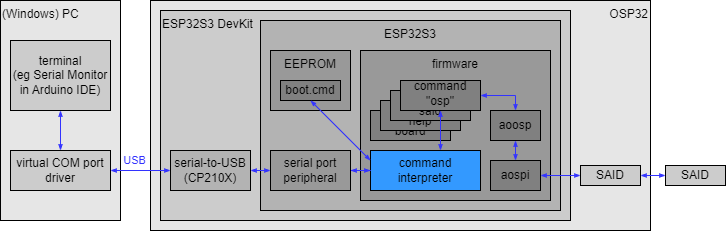
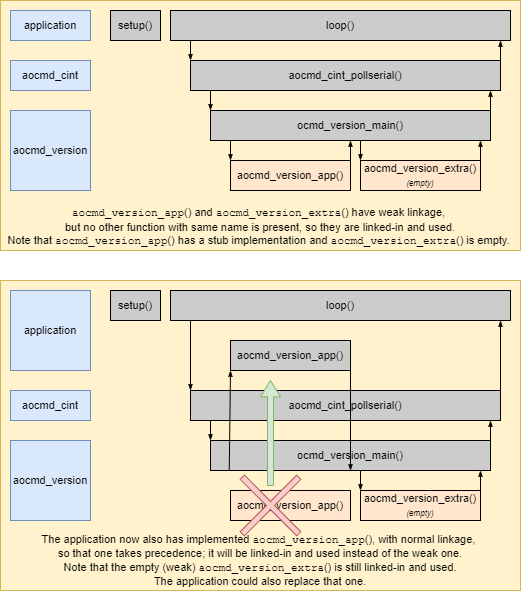

# OSP CommandInterpreter aocmd

Library "OSP CommandInterpreter aocmd", usually abbreviated to "aocmd", 
is one of the **aolibs**; short for Arduino OSP libraries from ams-OSRAM.
This suite implements support for chips that use the Open System Protocol, 
like the AS1163 ("SAID") or the OSIRE E3731i ("RGBi").
The landing page for the _aolibs_ is on 
[GitHub](https://github.com/ams-OSRAM/OSP_aotop).


## Introduction

Library _aocmd_ contains a command interpreter and several commands.
The interesting command is "osp"; it allows sending and receiving OSP telegrams.



The command interpreter can be extended with application specific commands.
Furthermore, a command file can be stored persistently on the ESP32, 
and executed at startup. 


### System setup

The diagram below shows the system architecture from a command interpreter point of view.



On the right hand side, we see the OSP32 board with some SAIDs.
They are controlled by the firmware in the ESP, more specifically, 
via the OSP library (aoosp) which builds on top of the SPI library (aospi).

On the left hand side, we see a PC. It runs an application known as 
_terminal_. A famous one is [putty](https://www.putty.org/), but the
Serial Monitor in the Arduino IDE is also fine. Terminals allow a user
to enter commands (characters) and send them over a serial link to a 
"remote" (in our case OSP32). When the remote responds (with characters), 
data is sent back over the serial line and displayed by the terminal.

Since PC's no longer have serial ports, a serial-to-USB chip is used.
The ESP32S3 DevKit board employs an "CP210x USB to UART Bridge"
and the PC needs to have a driver for such a virtual COM port. 
Typically, the Arduino IDE installs those drivers. If not, download and 
install the [driver](https://www.silabs.com/developers/usb-to-uart-bridge-vcp-drivers).

Commands that the PC sends, arrive at the command interpreter, a part of the
ESP firmware. Commands like "echo", "help", "file", "osp" are received
and dispatched to command _handlers_. Those parse and then execute them,
for example by calling the _aoosp_ library.

There is one more feature: the ESP has a persistent memory (EEPROM).
The command interpreter has a command to show, enter an execute one 
command file (known as `boot.cmd`). This command file is automatically
executed on power-on-reset. The maximum size of `boot.cmd` is 2k byte.


### Example commands

This section gives a flavor of the stock commands. It is possible to 
add your own, and for example the _aomw_ and _aoapps_ libraries add 
(more high-level) commands. This does mean that it depend on the firmware 
flashed to the ESP32 which commands are available. To follow the below 
command fragments it is suggested to use the firmware
[osplink](https://github.com/ams-OSRAM/OSP_aotop/tree/main/examples/osplink).
Others, like [saidbasic](https://github.com/ams-OSRAM/OSP_aotop/tree/main/examples/saidbasic)
also include most commands, but the included apps need to be stopped first
otherwise their control of the OSP chain might interfere with the entered
commands.


#### General commands

Once a terminal is connected and the OSP32 board is rebooted, we are greeted 
with a banner.

```
  ____   _____ _____    _ _       _
 / __ \ / ____|  __ \  | (_)     | |
| |  | | (___ | |__) | | |_ _ __ | | __
| |  | |\___ \|  ___/  | | | '_ \| |/ /
| |__| |____) | |      | | | | | |   <
 \____/|_____/|_|      |_|_|_| |_|_|\_\
OSPlink - version 1.7

spi: init
osp: init
cmd: init
mw: init
ui32: init

No 'boot.cmd' file available to execute
Type 'help' for help
>> 
```

Note that a prompt `>>` is printed. This means that commands can be entered.
The easiest commands are `version` and `echo` (shown below with an extra CR 
in between):

```
>> version
app     : OSPlink 1.7
runtime : Arduino ESP32 3_0_3
compiler: 12.2.0
arduino : 10607 (likely IDE2.x)
compiled: Sep  3 2024, 09:41:17
aolibs  : result 0.4.0 spi 0.5.0 osp 0.4.0 cmd 0.5.1
>> 
>> echo Hello, world!
Hello, world!
```

A better place to start however, is the `help` command. 

```
>> help
Available commands
board - board info and commands
echo - echo a message (or en/disables echoing)
file - manages the file 'boot.cmd' with commands run at startup
help - gives help (try 'help help')
osp - sends and receives OSP telegrams
said - sends and receives SAID specific telegrams
topo - build, query and use topology
version - version of this application, its libraries and tools to build it
```


As we see, the `help` command in isolation lists all commands.
It can also give help on a specific command; just append the command name.
Help on `version` is nicely short:

```
>> help version
SYNTAX: version
- lists version of this application, its libraries and tools to build it
NOTES:
- supports @-prefix to suppress output
```

The help for the `echo` command is longer; but the help command allows 
selecting one "topic". Below the `wait` sub command of `echo` is explained.

```
>> help echo wait
SYNTAX: echo wait <time>
- waits <time> ms (might be useful in scripts
```

The command interpreter allows commands to be shortened (even to 
one character). So `version`, `ver` and `v` all give the same result. 
This also holds for sub commands, so `help version`, `help ver` and `help v` 
all give the same result. The two abbreviations can be combined:

```
>> h v
SYNTAX: version
- lists version of this application, its libraries and tools to build it
NOTES:
- supports @-prefix to suppress output
```

Some commands support a `@` as prefix; it suppresses output of that command.
For example, setting the direction mux, gives feedback on the final state. 
This can be suppressed by prepending the `@`. The fragment below illustrates 
that, and it also shows that comments start with `//`.


```
>> // comment without command
>> osp dirmux loop // shows new status
dirmux: loop
>> @osp dirmux loop // with @ no feedback on new status
>>
```

In the above command the `@` suppresses _all_ output, in other commands 
the `@` only _reduces_ the output. For example, `help` on a command reduces 
to only the section headers.

```
>> @help echo
SYNTAX: echo [line] <word>...
SYNTAX: echo faults [step]
SYNTAX: echo [ enabled | disabled ]
SYNTAX: echo wait <time>
NOTES:
```

#### Boot.cmd

The command interpreter has a small local file system that can store a 
single file `boot.cmd`. To create `boot.cmd` use the `file record` command, 
and enter line after line, terminating with an empty line.

```
>> file record
001>> echo Hello, world!
002>> @version // short version
003>> 
file: 28 bytes written
```

Note that while the `boot.cmd` file is recorded, the prompt shows line 
numbers (eg `001>>`).

The file `boot.cmd` can be inspected,

```
>> file show
file: 'boot.cmd' content:
echo Hello, world!
@version
```

and executed.

```
>> file exec
>> echo Hello, world!
Hello, world!
>> @version
SAIDbasic 2.4
>> 
```

As the name suggests the file `boot.cmd` will be executed when the ESP32 
(cold) boots (officially known as POR - power-on-reset). When we press 
the reset (RST) button on OSP32, we see the script in action.

```
  ____   _____ _____    _ _       _
 / __ \ / ____|  __ \  | (_)     | |
| |  | | (___ | |__) | | |_ _ __ | | __
| |  | |\___ \|  ___/  | | | '_ \| |/ /
| |__| |____) | |      | | | | | |   <
 \____/|_____/|_|      |_|_|_| |_|_|\_\
OSPlink - version 1.7

spi: init
osp: init
cmd: init
mw: init
ui32: init

Running 'boot.cmd'
>> echo Hello, world!
Hello, world!
>> @version
OSPlink 1.7
>> 

Type 'help' for help
>> 
```

In practice, `boot.cmd` is used to configure a demo. For example for
[saidbasic](https://github.com/ams-OSRAM/OSP_aotop/tree/main/examples/saidbasic)
could have the following lines in `boot.cmd` to configure the overall 
brightness and to define the available flags. Note the `@` symbols; they 
suppress output, which makes sense in a command file.


```
@topo dim 50
@apps conf swflag set  europe dutch italy mali
```

To erase the `boot.cmd`, give the `file record` command and immediately 
terminate recording by entering an empty line (pressing CR).

```
>> file record
001>> 
file: 0 bytes written
>> file show
file: 'boot.cmd' empty
>> 
```


The `board` command gives information on the ESP hardware.

```
>> board
chip : model ESP32-S3 (2 cores) rev 0
clk  : 240 MHz (xtal 40 MHz)
ftrs : 2.4GHz-WiFi Bluetooth-LE
flash: 4194304 byte external flash
app  : 378544 byte
reset: power-on
```

An interesting sub command, especially during development, is `board reboot`;
it resets the ESP. This is a software reset, not a power-on-reset, it
does _not_ execute `boot.cmd`. In other words `reboot` invokes a clean 
restart of the ESP. Note however, that the OSP nodes and the OLED remain 
powered, so they keep their state, unless the ESP firmware resets them. 

If `boot.cmd` is needed after `board reboot`, give command `file exec`.

#### OSP generic commands

The commands presented until now (`echo`, `help`, `version`, `board`, `file`)
are managerial. The commands `osp` and `said` allow manipulating and 
inspecting OSP nodes.

> The below fragments assume that a SAIDbasic board is connected to the 
> OSP32 board in loop mode (cable from OSP32 OUT to SAIDbasic IN and a cable
> from SAIDbasic OUT to OSP32 IN).
>
> The fragments also assume that no firmware is running that sends telegrams. 
> The easiest way is to use a firmware that is "command interpreter only" like
> [osplink](https://github.com/ams-OSRAM/OSP_aotop/tree/main/examples/osplink).
> If you use a firmware that has _apps_ like 
> [saidbasic](https://github.com/ams-OSRAM/OSP_aotop/tree/main/examples/saidbasic)
> the apps continuously send telegrams and that has to be stopped first.
> This can be done by activating the do-nothing app via the command `apps switch voidapp`.
>
> Some fragments assume `reset` and `init` telegrams (after setting the dirmux) 
> have been sent (the `osp restinit` does all three).

The `osp` command is able to enumerate which nodes are in the OSP chain
(and with that estimate the maximum power usage).

```
>> osp enum
 mcu N001 00000040/SAID T0 T1 I0 lvds
lvds N002 00000040/SAID T2 T3 T4 lvds
lvds N003 00000040/SAID T5 T6 T7 lvds
lvds N004 00000000/RGBI T8 lvds
lvds N005 00000040/SAID T9 T10 I1 lvds
lvds N006 00000000/RGBI T11 lvds
lvds N007 00000000/RGBI T12 lvds
lvds N008 00000000/RGBI T13 lvds
lvds N009 00000040/SAID T14 T15 T16 eol
nodes(N) 1..9, triplets(T) 0..16, i2cbridges(I) 0..1, dir loop
count rgbi 4 said 5
maxpower 12x50mA + 15x48mA + 15x24mA + 9x24mA = 1.896A (9.480W)
>> 
```

This shows there are 9 nodes, the first (`mcu`) and last (`eol`) both connected 
to the ESP (`dir loop`). Nodes 001, 002, 003, 005 and 009 are SAIDs, the
other 4 RGBIs. Two SAIDs (001 and 005) have an I2C bridge enabled (I0 and I1).
In total there are 17 RGB triplets (4 RGBIs, 3 SAIDs with 3, 2 SAIDs with 2).

The `osp` command has information on all (currently known) telegrams ("user manual").
This information is retrieved with the `info` sub command.

```
>> osp info readpwmchn
TELEGRAM 4E: readpwmchn
DESCRIPTION: Returns current PWM setting (for all three LEDs) of the 
             requested channel.
CASTING    : uni 
PAYLOAD    : 1 (chn); response 6 (red1 red0 grn1 grn0 blu1 blu0)
STATUS REQ : no (no sr possible)
DUPLICATE  : 4E/readpwm
```

This information explains (1st line) that `readpwmchn` has telegram id 0x4E, 
and that it is sent using unicast (3rd line) not broadcast or serial cast 
(those are never supported for telegrams that return some information).
The description (2nd line) explains that the telegram returns RGB settings 
for one channel. The 4th line shows the telegram payload bytes 
in detail: the command telegram has 1 byte, the channel, the response 
telegram has 6 bytes, two for each color. No status (line 5) will be 
returned (several commands have as feature that the node acknowledges 
with a status response); as this is not possible for telegrams that 
return some information. Finally this identifies that there is a 
telegram with the same ID but different behavior (in this case that is
the very similar `readpwm` without a channel).

#### High level OSP

There is a "high level" way to send OSP telegrams.
The firmware will fill in the preamble, payload size indicator, telegram id and crc.
The following high level command sequence switches on two RGBs;
the first (SAID 001 channel 0) to green, the second (SAID 2 channel 0)
to blue. The info for `setpwmchn` explains the 8 bytes payload: 
`chn unused red1 red0 grn1 grn0 blu1 blu0` (the reason for the unused byte FF
is that OSP telegrams can have a length of 8 but not 7).

```
osp send 000 reset
osp send 001 initbidir
osp send 000 clrerror
osp send 000 goactive
osp send 001 setpwmchn 00  FF  00 00  11 11  00 00
osp send 002 setpwmchn 00  FF  00 00  00 00  11 11
```

This is the sequence in action.

```
>> osp dirmux bidir // ensure the mux matches the init (below)
dirmux: bidir
>>
>> osp send 000 reset 
tx A0 00 00 22
rx none ok
>> osp send 001 initbidir 
tx A0 04 02 A9
rx A0 25 02 6B 50 7F (230 us) ok
>> osp send 000 clrerror 
tx A0 00 01 0D
rx none ok
>> osp send 000 goactive 
tx A0 00 05 B1
rx none ok
>> osp send 001 setpwmchn 00 FF 00 00 11 11 00 00 
tx A0 07 CF 00 FF 00 00 11 11 00 00 49
rx none ok
>> osp send 002 setpwmchn 00 FF 00 00 00 00 11 11
tx A0 0B CF 00 FF 00 00 00 00 11 11 5D
rx none ok
```

#### Low level OSP

The above "high level" command does show the raw bytes being transferred.
There is also a "low level" way to send OSP telegrams. This is especially 
useful for testing. For low level telegrams, the user has 
to enter all details (all bytes); but there is a feature to get the CRC computed. 
We can use the high level commands first to get those details.

```
osp tx A0 00 00 22 // 000 reset
osp tx A0 04 02 A9 // 001 initbidir
osp tx A0 00 01 0D // 000 clrerror
osp tx A0 00 05 B1 // 000 goactive
osp tx A0 07 CF 00 FF 00 00 11 11 00 00 49 // 001 setpwmchn 00 grn
osp tx A0 0B CF 00 FF 00 00 00 00 11 11 5D // 002 setpwmchn 00 blu
```

If commands are sent, they are validated (see `osp validate`).
Even if validation fails, for example because the CRC doesn't match, 
or the payload doesn't match, the telegram is still sent. 
This allows for testing error behavior also.

Validation can be switched off (to make transfers faster) with `osp validate disable`.
There are other managerial subcommands (`osp log` and `osp cound` and to
some extend `osp hwtest`).

A typical initialization sequence is as follows. 
The broadcast (000) of the `reset` telegram resets all nodes;
this also wipes there addresses. The serial cast of `initloop` reassigns
addresses (starting at 001). Make sure the direction mux is configured
to match the wiring of the demo board, and make sure the `initloop`/`initbidir`
matches the direction mux.

```
osp send 000 reset
osp dirmux loop
osp send 001 initloop
```

or 

```
osp send 000 reset
osp dirmux bidir
osp send 001 initbidir
```

This can be abbreviated to

```
osp resetinit
```

which first tries Loop, and then BiDir (and also controls the dirmux).

#### Topo for OSP

Some firmware variants contain the command `topo` which supports an even 
higher abstraction in operating an OSP chain. It builds a data structure called 
the _topology map_, which identifies how many RGB triplets there are (and 
for each triplet if it is a stand-alone RGBI or an RGB module connected to 
a SAID). The command `topo pwm` allows setting the color of a triplet,
abstracting away if it is an RGBI or an RGB connected to a SAID.

The below fragment switches RGB triplet 6 to red.
It also sets the "global brightness" of the topo module 
to 50‰ (actually "pro [kibi](https://en.wikipedia.org/wiki/Binary_prefix#kibi)").

```
>> topo build // includes resetinit
nodes(N) 1..9, triplets(T) 0..16, i2cbridges(I) 0..1, dir loop
>> topo dim 50
dim 50/1024 (said 41x, rgbi 104x below max power)
>> topo pwm 6 1111 0000 0000
pwm T6: 1111 0000 0000
```

#### SAID I2C 

In addition to the generic `osp` command, there is the `said` command,
with support specifically for the SAID chip.
The fragment below scans the entire OSP chain for SAIDs, 
checks if they have an I2C bus, and if so, scans the I2C bus.

```
>> said i2c 000 scan
SAID 001 has I2C (now powered)
  00:  00  01  02  03  04  05  06  07  08  09  0a  0b  0c  0d  0e  0f 
  10:  10  11  12  13  14  15  16  17  18  19  1a  1b  1c  1d  1e  1f 
  20:  20  21  22  23  24  25  26  27  28  29  2a  2b  2c  2d  2e  2f 
  30:  30  31  32  33  34  35  36  37  38  39  3a  3b  3c  3d  3e  3f 
  40:  40  41  42  43  44  45  46  47  48  49  4a  4b  4c  4d  4e  4f 
  50:  50  51  52  53 [54] 55  56  57  58  59  5a  5b  5c  5d  5e  5f 
  60:  60  61  62  63  64  65  66  67  68  69  6a  6b  6c  6d  6e  6f 
  70:  70  71  72  73  74  75  76  77  78  79  7a  7b  7c  7d  7e  7f 
SAID 001 has 1 I2C devices

SAID 005 has I2C (now powered)
  00:  00  01  02  03  04  05  06  07  08  09  0a  0b  0c  0d  0e  0f 
  10:  10  11  12  13  14  15  16  17  18  19  1a  1b  1c  1d  1e  1f 
  20: [20] 21  22  23  24  25  26  27  28  29  2a  2b  2c  2d  2e  2f 
  30:  30  31  32  33  34  35  36  37  38  39  3a  3b  3c  3d  3e  3f 
  40:  40  41  42  43  44  45  46  47  48  49  4a  4b  4c  4d  4e  4f 
  50: [50] 51  52  53  54  55  56  57  58  59  5a  5b  5c  5d  5e  5f 
  60:  60  61  62  63  64  65  66  67  68  69  6a  6b  6c  6d  6e  6f 
  70:  70  71  72  73  74  75  76  77  78  79  7a  7b  7c  7d  7e  7f 
SAID 005 has 2 I2C devices

total 2 SAIDs have 3 I2C devices
>> 
```

The `@` version is much less verbose

```
>> @said i2c 000 scan
[54] SAID 001 has 1 I2C devices
[20][50] SAID 005 has 2 I2C devices
total 2 SAIDs have 3 I2C devices
```

Both show that at address 001 there is a SAID with an I2C device with 
address 54. That happens to be an (AT24C02C) EEPROM. Let's try to read
8 bytes from address 80.

```
>> said i2c 001 read 54 80 8
said(001).i2c.dev(54).reg(80) FF FF FF FF FF FF FF FF
```

All bytes are FF. We change the middle four to "DEADBEEF". 

```
>> said i2c 001 write 54 82 DE AD BE EF
said(001).i2c.dev(54).reg(82) DE AD BE EF
>> said i2c 001 read 54 80 8
said(001).i2c.dev(54).reg(80) FF FF DE AD BE EF FF FF
```

And we restore that (using `@` for reduced output)

```
>> @said i2c 001 write 54 82 FF FF FF FF
>> @said i2c 001 read 54 80 8
FF FF FF FF FF FF FF FF
```

#### SAID OTP 

Another (advanced) feature of the `said` command is reading the OTP.

```
> said otp 001
otp: 0x0D: 09 00 00 00 00 00 00 00 00 00 00 00 00 00 00 00 00 00 00
otp: CH_CLUSTERING     0D.7:5 0
otp: HAPTIC_DRIVER     0D.4   0
otp: SPI_MODE          0D.3   1
otp: SYNC_PIN_EN       0D.2   0
otp: STAR_NET_EN       0D.1   0
otp: I2C_BRIDGE_EN     0D.0   1
otp: *STAR_START       0E.7   0
otp: OTP_ADDR_EN       0E.3   0
otp: STAR_NET_OTP_ADDR 0E.2:0 0 (0x000)
```

It is also possible to read a specific byte of the OTP. But writing a byte 
requires a password, which can be set with the command `said password`.

```
>> said otp 001 0D
SAID[001].OTP[0D] -> 09 (ok)
>> said otp 001 0D 08
WARNING: WARNING: ask ams-OSRAM for TESTPW and see aoosp_said_testpw_get() for how to set it
SAID[001].OTP[0D] <- 08 (ok)
>> said otp 001 0D
SAID[001].OTP[0D] -> 09 (ok)
```


## Examples

This library comes with the following examples.
You can find them in the Arduino IDE via 
File > Examples > OSP CommandInterpreter aocmd > ...

- **aocmd_min** ([source](examples/aocmd_min))  
  This demo initializes the command interpreter, then starts
  polling `Serial` for incoming characters. These are buffered until an 
  end-of-line is received (either CR or LF), then the command is parsed 
  and executed. This demo does not add its own command.

- **aocmd_owncmd** ([source](examples/aocmd_owncmd))  
  This demo implements an application specific command, and
  registers it with the command interpreter.
  The new command has name `stat`. It allows passing several (hex) numbers.
  The `stat` command keeps track of the count and the sum.

- **aocmd_boot** ([source](examples/aocmd_boot))  
  This demo implements an application that prints a message every x ms.
  It adds a command ("wait") to set and get x.
  This command can then be stored in `boot.cmd`, to configure this app persistently.

- **aocmd_template** ([source](examples/aocmd_template))  
  This sketch is a template for an application with a command handler.
  It includes an application banner, it implements the upcalls from 
  the "version" command, and it runs `boot.cmd` on startup.
 
There is also an official executable - as opposed to an example.

- **osplink** ([source](https://github.com/ams-OSRAM/OSP_aotop/tree/main/examples/osplink))  
  This application allows the PC (with a terminal like the Arduino Serial Monitor)
  to send and receive OSP telegrams, using serial-over-USB. 
  
  It even comes with an _experimental_ Python library [libosplink](python/libosplink) 
  and a Python application [exosplink](python/exosplink)
  

## Module architecture

This library contains several modules, see the figure below for an overview (arrows indicate `#include`).


- **aocmd_cint** (`aocmd_cint.cpp` and `aocmd_cint.h`) is the core module 
  of the library; it implements the command interpreter. 
  All other modules implement command handlers.
  The command handlers are registered with the command interpreter.
  When the user enters a command whose name matches one of the registered ones,
  the command interpreter calls the handler.
  
  The command interpreter is a recycled library 
  [https://github.com/maarten-pennings/cmd](https://github.com/maarten-pennings/cmd).
  Version 8.1.0 is used. 
  The prefix is changed from `cmd` to `aocmd_cint`, and two friend commands (`echo` and `help`) 
  were split off (put in separate files).
  No API documentation has been added.

- **aocmd_echo** (`aocmd_echo.cpp` and `aocmd_echo.h`) is the first friend command of
  the command interpreter. Friend, because it _configures_ the command interpreter,
  e.g. enable/disable command echoing.

- **aocmd_help** (`aocmd_help.cpp` and `aocmd_help.h`) is the second friend command of
  the command interpreter. Friend, because it knows which commands are registered 
  with the command interpreter, so it can provide help on them.

  Use `help xxx` to get (syntax) help on command `xxx`.

- **aocmd_board** (`aocmd_board.cpp` and `aocmd_board.h`) is a generic command giving some
  information about the board: which micro controller (revision, features), memory sizes.
  It also allows the user to issue a software reset (`board reboot`); this resets the ESP 
  and restarts the software.

  Note that `aocmd_board` has intimate knowledge of the ESP32S3, so it is 
  unlikely to run unmodified on other CPUs.
  
- **aocmd_version** (`aocmd_version.cpp` and `aocmd_version.h`) is a generic command listing
  various versions: of the application, libraries, compiler, and IDE. It has two callbacks,
  one for the application to print is version number, and one generic, for any other
  version info an application might want to print.

- **aocmd_file** (`aocmd_file.cpp` and `aocmd_file.h`) is a generic command that manages
  one file (`boot.cmd`) stored in a simple persistent file system (EEPROM of ESP, max 2k byte).
  The crux of `boot.cmd` is that it runs on power-on, so it can be used to configure an
  application.

- **aocmd_osp** (`aocmd_osp.cpp` with `aocmd_osp.i`, and `aocmd_osp.h`) is the core command to support the OSP
  protocol. The `info` sub command is a "help" command giving all (details of all) 
  telegrams, `enum` enumerates the nodes in the OSP chain connected to the MCU, and `resetinit`
  resets and initializes the OSP chain.
  
  The key sub commands are `send` and `tx`. They allows sending (and receiving the response)
  telegrams. The `send` command is high level; the preamble, payload size, telegram id, crc
  are supplied automatically. The `tx` is low level, all bytes have to be hand composed.
  Both commands allow sending miss-formed telegrams (`tx` even more so than `send`). This
  allows checking error handling behavior and border cases.
  
  The file `aocmd_osp.i` contains a table of all know telegrams. It is used to select
  telegrams by name, provide info on telegrams, and to validate the fields of telegrams, 
  like the payload size.
  
- **aocmd_said** (`aocmd_said.cpp` and `aocmd_said.h`) command is for specific 
  SAID features. For example it supports sub commands to read and write 
  OTP memory and I2C messages.


## API

The header [aocmd.h](src/aocmd.h) contains the API of this library.
It includes the module headers 
[aocmd_cint.h](src/aocmd_cint.h), 
[aocmd_echo.h](src/aocmd_echo.h), 
[aocmd_help.h](src/aocmd_help.h), 
[aocmd_board.h](src/aocmd_board.h), 
[aocmd_version.h](src/aocmd_version.h), 
[aocmd_file.h](src/aocmd_file.h), 
[aocmd_osp.h](src/aocmd_osp.h), and
[aocmd_said.h](src/aocmd_said.h).

The headers (h files) contain little documentation; for details see the 
module sources (cpp files). 


### aocmd

- `aocmd_init()` initializes the library (command interpreter and file system).
- `AOCMD_VERSION`  identifies the version of the library.
- `aocmd_register()` registers all commands from this library - a shorthand 
  for calling the register of all commands contained in the library individually.


### aocmd_cint

This module is recycled from the public domain. The header file contains 
one-line explanations of each function. Here we will just give a high level 
overview.

- There are several macros `AOCMD_CINT_XXX` which configure the "size" of the 
  command interpreter, like the maximum number of registered commands or the 
  maximum length of a command line.

- For applications _using_ a command line the key functions (after `aocmd_init()`) 
  are `aocmd_cint_prompt()` and `aocmd_cint_pollserial()`.
  
  ```c++
  void setup() {
    Serial.begin(115200);
    ...
    aocmd_init(); 
    aocmd_register();
    ...
    // optional: aocmd_file_bootcmd_exec_on_por(); 
    ...
    aocmd_cint_prompt();
  }

  void loop() {
    aocmd_cint_pollserial();
    ...
  }
  ```

- When _implementing_ a command, the signature of the command handler 
  (`aocmd_cint_func_t`) is important, as well as how to register it 
  (`aocmd_cint_register()`). In the command handler, parser routines such as 
  `aocmd_cint_parse_hex()` and `aocmd_cint_isprefix()` are helpful.


### aocmd_echo, aocmd_help, aocmd_board, aocmd_version, aocmd_file, aocmd_osp, aocmd_said

All these modules have a function to register the command. We take "echo" 
as example.

- `aocmd_echo_register()` registers the built-in "echo" command with the command interpreter.

Recall that `aocmd_register()` calls all register functions in this library.
So, either call that one, or call a subset of `aocmd_xxx_register()`.

Some of the modules require initialization like `aocmd_file_init()` and 
`aocmd_osp_init()`. This initializes the file system, respectively telegram 
parser, but these inits are called from `aocmd_init()`, so normal client code 
does not need to call any of them.


### aocmd_version

In addition to `aocmd_version_register()`, there are two other public
functions. These are so-called weak upcalls from the `version` command handler.

- **weak** `aocmd_version_app()`; it shall print to Serial the application name and version.
- **weak** `aocmd_version_extra()`; it may print to Serial additional ingredients with name and version.

"Weak" means that an application can re-implement those functions 
(using the exact same name), and those re-implementations take precedence 
over these weak implementations. For details see the section
[Upcalls via weak linking](#upcalls-via-weak-linking) below.

The default implementation of the two functions is printing a stub line 
respectively printing nothing. 


### aocmd_file

In addition to `aocmd_file_register()` and `aocmd_file_init()`, there is 
one other public function:

- `aocmd_file_bootcmd_exec_on_por()` executes the file `boot.cmd` on 
  power on reset, by feeding its content to the command interpreter.

- Note that the size of `boot.cmd` is limited to 2047 including the 
  terminating 0.


## Execution architecture

### Main loop

When the command interpreter is integrated into an Arduino application, 
it has the following form:

```c++
void setup() {
  Serial.begin(115200);
  aocmd_init(); 
}

void loop() {
  aocmd_cint_pollserial();
  ...other...
}
```

- The command interpreter uses `Serial` to receive commands and transmit answers.
  This usage is implicit (accessing the global symbol `Serial`), so `Serial` 
  must have been `begin()`.

- The command interpreter must have been initialized, this is part 
  of `aocmd_init()`.

- Finally, the function `aocmd_cint_pollserial()` is a convenience function.
  It check `Serial` for incoming characters, and passes them to the command 
  interpreter.
  The command interpreter stores them until a CR or LF is received.
  Then the command interpreter parses the command line (splits it in 
  arguments `argc` and `argv[]`), looks up the command name and executes 
  the associated handler.

- The function `aocmd_cint_pollserial()` checks for incoming characters using 
  the `HardwareSerial` interrupt service routine. That routine picks up 
  incoming characters, and stores them in in a buffer with size 
  `HardwareSerial_rxBufferSize(256)`. 
  
  In other words, when characters come in at a high pace there is a risk of 
  losing them (buffer overflow). To mitigate this risk, and for the liveliness 
  of the command interpreter, it is best if the execution time of `...other...`
  is small (well below 100ms).


### Upcalls via weak linking

The `aocmd` uses weak linking as a mechanism to let the library upcall to 
the application.

It is used by the `version` command. It has two functions with weak linkage 
`aocmd_version_app()` and `aocmd_version_extra()`.
The first one is a stub printing `no application version version registered`; it shall be replaced by a function in the application that
prints to Serial the application name and version.

The second function is empty; it may be replaced by am application specific function 
that prints to Serial additional ingredients with name and version.

The diagram below explains the behavior of the compiler and the resulting 
call graph.




## Python (experimental)

The examples directory of _aotop_ contains an Arduino sketch 
[osplink.ino](https://github.com/ams-OSRAM/OSP_aotop/tree/main/examples/osplink).
This is an application, that contains just the command interpreter, 
and with that the commands to send and receive telegrams.

The directory `python` in _aocmd_ contains a Python library 
(`libosplink`). This library has one object (`CmdInt` in module `cmdint.py`) 
that can communicate with any command interpreter, and one object 
(`OSPlink` in module `osplink.py`) that can communicate to the command 
interpreter as implemented in the Arduino `osplink` sketch.

The directory `python` also contains two Python examples,
one for each module, that demonstrate how to use those objects. 
See the [readme](python) for instructions. Note that the Python
library is an experimental proof-of-concept.


## Version history _aocmd_

- **2024 October 24, 0.5.6**
  - New command `said password` to get/set SAID password in `aoosp` store.

- **2024 October 22, 0.5.5**
  - Added command `osp aoresult [ <filter> ]` to show errors (nr/id/description).
  - Added command `osp fields <data>...`, similar to python dissector.
  - Fixed typos in python `readme.md`s.
  
- **2024 October 8, 0.5.4**
  - Prefixed `modules.drawio.png` with library short name.
  - Moved domain from `github.com/ams-OSRAM-Group` to `github.com/ams-OSRAM`.
  - Updated readme's for Python.
  
- **2024 September 10, 0.5.3**
  - Added I2C read and write commands `said i2c <addr> read|write` and updated `readme.md`.
  - Added I2C frequency control `said i2c <addr> freq [<freq>]`.
  - Added arguments to functions in `osplink.py` and `exosplink.py`.
  - Extra top-level readme for `python`, and update of deeper Python readme's.
  - Added power estimate to `osp enum`.
  - Shortened filename in `aocmd_template.ino`.
  - Updated description of examples (BEHAVIOR section).
  - Some `DC3` chars removed from `readme.md`.
  
- **2024 August 5, 0.5.2**
  - Updated section "Example commands".
  - More uniform error messages in command handlers "'xxx' expects 'yyy', not 'zzz'".

- **2024 August 28, 0.5.1**
  - Command `help <cmd>` now has topic selector.
  - Commands `help` and `said` now support prefix-@ to suppress output.
  - Command `osp` now prints round trip time.
  - More uniform error messages in command handlers "'xxx' expected 'yyy', not 'zzz'", "'xxx' has unknown argument ('zzz')", and "'xxx' has too many args"
  - Removed `[@]` in SYNTAX help.
  - Added links in `readme.md` for all example sketches.
  - Commands `osp send`, `osp tx`, and `osp trx` validate initloop/bidir telegrams against dirmux state.
  - Updates to `readme.md` and `system.drawio.png`.
  
- **2024 August 9, 0.5.0**  
  - Added comment on `F()` and `PSTR()`; `aocm_board` being ESP32S3 specific and `boot.cmd` being 2k max.
  - Removed `docname` (aka old name or datasheet name) in `aocmd_osp.cpp`/`aocmd_osp.i`.
  - Corrected link to GitHub from aotop to OSP_aotop.
  - Remove "oalib" from `sentence=` in `library.properties`.
  - Typos in `aocmd_cint.h` fixed
  - Arduino name changed from `OSP Command interpreter - aocmd` to `OSP CommandInterpreter aocmd`.
  - Renamed dir `extra` to `extras`.
  - Added command `osp hwtest` to help testing the OSP32 board.
  - Command `osp enum` now has summary formatted the same as `topo enum`.
  - `license.txt` line endings changed from LF to CR+LF.

- **2024 July 02, 0.4.4**  
  - Initial release candidate.


(end)
